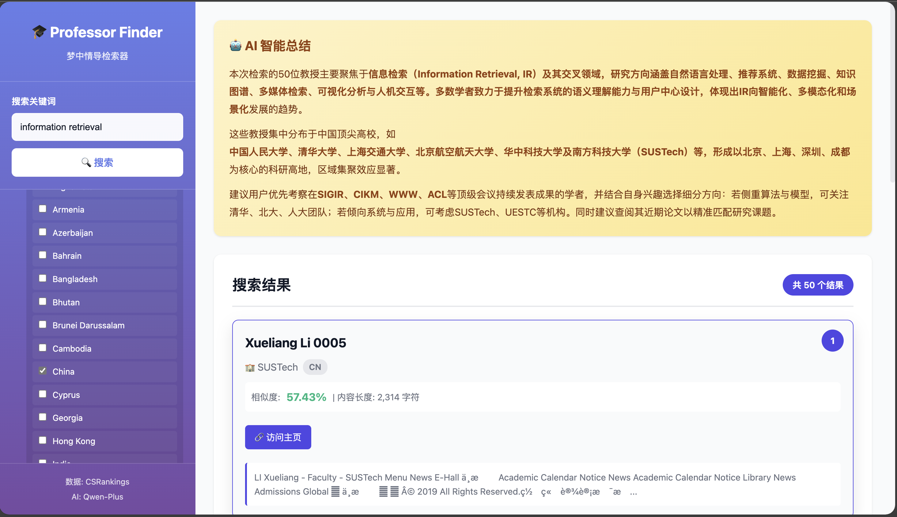

# 🎓 梦中情导检索器2.0 (DreamAdvisor Finder)

> **基于语义向量检索 (Embedding) 的 CS/AI 领域导师匹配平台** \> 打破语言壁垒，支持中英互搜，搭配 AI 智能总结。

-----

## ✨ 核心特性

### 1\. **深度语义搜索 (Semantic Search)** 🧠

  - **摒弃传统关键词匹配**：从 TF-IDF 升级为 **Vector Embedding** 技术。
  - **中英跨语言检索**：直接搜中文（如“信息检索”），精准匹配英文主页（"Information Retrieval"），彻底解决语言鸿沟。
  - **模型驱动**：集成 **BAAI/bge-base-zh-v1.5** 模型，理解查询意图而非字面匹配。

### 2\. **硬件加速优化** ⚡️

  - **Apple Silicon 原生支持**：针对 Mac M-series 芯片优化。
  - **MPS 加速**：利用 Metal Performance Shaders 调用 GPU 进行向量计算，性能提升显著。
  - **智能缓存**：首次运行自动构建向量索引，二次启动实现**秒级加载**。
### 3. **灵活过滤** 📑
- 按**地区**过滤（如 Asia, Europe, Americas）
- 按**国家**过滤（支持国家名称和代码）
- 智能分层过滤，支持地区-国家联动

### 4. **AI 智能总结** 🤖
- 使用 **Qwen-AI** 自动分析 Top 50 搜索结果
- 生成中文总结，包括研究方向、机构分布、领域特点等
- 支持 Markdown 格式渲染

### 5. **Web 可视化界面** 🌐
- 简约美观的现代化设计
- 左右分栏布局（过滤器 + 结果展示）
- 分页显示（每页 5 个结果）
- 响应式设计

---

## 📊 数据统计

- **总教授数**：31,951 位
- **有主页内容**：22,823 位（71.4%）
- **覆盖国家/地区**：249 个

---

## 🚀 快速开始

### 1\. 环境准备

建议使用虚拟环境（Python 3.8+）：

```bash
# 创建并激活虚拟环境
python3 -m venv venv
source venv/bin/activate

# 安装依赖 (新增 pytorch & sentence-transformers)
pip3 install -r scripts/requirements.txt
```

### 2\. 配置国内加速 (重要\!) 🇨🇳

为防止模型下载卡顿，**运行前请务必执行**：
```bash
export HF_ENDPOINT=https://hf-mirror.com
```

### 3\. 启动引擎
```bash
# 方法 1: 使用 app.py
python3 app.py

# 方法 2: 使用快速启动脚本（推荐）
python3 quick_start.py

# 方法 3: 使用 shell 脚本
./start_web.sh
```

### 4\. 访问

浏览器打开: **http://localhost:5001**

-----

## 📊 数据与技术栈

  - **数据规模**：覆盖 **31,951** 位教授，**249** 个国家/地区。
  - **核心模型**：`BAAI/bge-base-zh-v1.5` (768维向量)。
  - **向量索引**：约 23,000 × 768 矩阵 (FP32)。

### 技术架构

| 组件 | 技术选型 | 说明 |
| :--- | :--- | :--- |
| **检索内核** | **Sentence-Transformers** | 向量化与余弦相似度计算 |
| **计算后端** | **PyTorch (MPS)** | Apple Silicon GPU 加速支持 |
| **AI 总结** | **Qwen-Plus** | 阿里云 Dashscope API |
| **Web 框架** | **Flask 3.0** | 轻量级后端服务 |
| **前端** | **HTML5 + JS** | 响应式设计，Markdown 渲染 |

-----

## 🌐 使用示例

### 界面布局
```
┌─────────────┬──────────────────────────────────┐
│             │  🤖 AI 智能总结                   │
│  [ 信息检索 ]│  ─────────────────────────────   │
│             │  用户正在寻找IR方向导师...         │
│             │  推荐关注人大的几位教授...         │
│  过滤器     │  ─────────────────────────────   │
│  ☑ 亚洲     │                                  │
│    ☑ 中国   │  📋 搜索结果 (语义匹配)           │
│    ☐ 日本   │  🏆 #1 - Ji-Rong Wen (文继荣)    │
│  ☐ 欧洲     │  🏫 Renmin University of China   │
│  ☐ 非洲     │  📊 相似度: 0.8214               │                  
│            │  📝 ...focus on IR and NLP...    │
│             │  🔗 访问主页 
│             │  [< 上一页] 第 1/10 页 [下一页 >]│
└─────────────┴──────────────────────────────────┘
```


### 使用步骤

1. **输入关键词**：在搜索框输入研究方向（如 "reinforcement learning"）
2. **选择过滤**（可选）：
   - 点击地区名称展开/收起国家列表
   - 勾选地区会自动勾选所有国家
   - 取消所有国家会自动取消地区勾选
3. **点击搜索**：等待 10-20 秒（包含 AI 总结生成）
4. **查看结果**：
   - AI 总结（顶部，支持 Markdown）
   - Top 50 教授列表（分页显示）
   - 每个卡片显示：排名、姓名、学校、职位、主页链接

---

## 📂 项目结构
```
professor_searcher/
├── app.py                             # Flask 主程序
├── quick_start.py                     # 启动脚本 (含环境检查)
├── start_web.sh                       # Shell 启动脚本
├── README.md                          # 项目说明
│
├── templates/                         # Flask 模板
│   └── index.html                     # 主页面
│
├── static/                            # 静态资源
│   ├── css/
│   │   └── style.css                  # 样式文件
│   └── js/
│       └── app.js                     # 前端逻辑
│
├── scripts/
│   ├── search_engine.py               # 核心引擎 (含 BGE 模型加载与 MPS 优化)
│   ├── process_data.py                # 数据清洗工具
│   ├── crawl_homepages.py             # 爬虫工具
│   └── requirements.txt               # 依赖清单
│
└── data/                              # 数据目录
    ├── raw/                           # 原始数据
    │   ├── countries.csv              # 国家地区信息
    │   ├── csrankings*.csv            # 教授基本信息
    │   └── institutions.csv           # 学校信息
    └── processed/                     # 处理后的数据
        ├── professors.json            # 教授元数据
        ├── professor_vectors.npy      # [核心] 预计算的向量缓存文件
        └── crawled_homepages/         # 教授网页文本
```

-----

## 💻 API 与 命令行

### Python 调用示例
```python
from scripts.search_engine import ProfessorSearchEngine

# 初始化 (自动加载向量缓存)
engine = ProfessorSearchEngine(enable_ai_summary=True)

# 语义搜索：直接用中文搜英文主页
# 会自动匹配到 "Information Retrieval", "Web Search" 等相关教授
result = engine.search("信息检索与大模型", top_k=50)

engine.print_results(result)
```

### API 接口

  - **POST** `/api/search`
  - **GET** `/api/filter-options`

-----

## ⚙️ 技术实现

### 后端核心
框架: Flask 3.0+
核心算法: Semantic Search (语义检索)
向量模型: BAAI/bge-base-zh-v1.5 (768维)
计算加速: PyTorch (MPS) - 专为 Apple Silicon (M1-M4) 优化
AI 总结: Qwen-Plus (通义千问)

### 前端技术
HTML5/CSS3: 响应式现代化布局
Vanilla JS: 原生 JavaScript 交互
Marked.js: Markdown 渲染器

### 性能指标 (基于 MacBook Air M4)

首次索引构建：2-4 分钟 (计算 22,000+ 教授向量)
后续热启动：< 1 秒 (直接读取 .npy 缓存)
搜索响应：< 200ms (向量点积运算)
AI 总结耗时：3-8 秒 (取决于 LLM API 响应)

## 🎨 界面设计

### 配色方案

主色调：学术紫渐变 (#667eea → #764ba2)
交互色：深靛蓝 (#4F46E5) - 用于按钮和高亮
状态色：翠绿 (#10B981) - 表示高相似度匹配
背景色：云雾灰 (#F9FAFB) - 护眼阅读体验

### 交互体验
- ✨ 圆角卡片设计
- 🎭 柔和阴影效果
- 🎬 流畅悬停动画
- 📱 响应式布局
- 🔄 实时加载反馈
  
`GET /api/status`
检查搜索引擎状态及硬件加速情况。
响应示例：
```
{
  "status": "ready",
  "device": "mps",
  "message": "Search engine is ready"
}
```
`GET /api/filter-options`
获取地区、国家等过滤维度。
响应示例：
```
{
  "success": true,
  "data": {
    "regions": ["Asia", "Europe", "Americas"],
    "countries": [
      {"name": "China", "alpha_2": "cn", "region": "Asia"},
      {"name": "United States", "alpha_2": "us", "region": "Americas"}
    ]
  }
}
```
`POST /api/search`
执行语义搜索。
请求体：
```
{
  "query": "信息检索与大语言模型",  // 支持直接中文搜索
  "regions": ["Asia"],
  "countries": ["cn", "sg"],
  "top_k": 20
}
```
响应示例：
```
{
  "success": true,
  "data": {
    "query": "信息检索与大语言模型",
    "results": [
      {
        "rank": 1,
        "name": "Ji-Rong Wen",
        "institution": "Renmin University of China",
        "country": "cn",
        "similarity_score": 0.8245,  // 余弦相似度
        "snippet": "...focus on Information Retrieval (IR), NLP and..."
      },
      ...
    ],
    "ai_summary": "根据搜索结果，推荐关注中国人民大学的文继荣教授..."
  }
}
```

## 🧪 测试示例 (中英互搜)

### 推荐搜索场景
由于使用了 BGE 语义模型，你可以尝试以下跨语言或概念性搜索：
中文搜英文主页：
信息检索 (对应 Information Retrieval)
联邦学习 (对应 Federated Learning)
具身智能 (对应 Embodied AI)
复杂概念搜索：
AI in healthcare (医疗AI)
Large Language Model reasoning (大模型推理)
Robotics path planning (机器人路径规划)
推荐过滤组合
找国内大牛：Region: Asia + Country: China
找美国名校：Region: Americas + Country: United States

## 📚 依赖项
```Plaintext
# 核心依赖
torch>=2.0.0              # 深度学习框架 (支持 MPS)
sentence-transformers>=2.2.0 # 向量检索库
numpy>=1.24.0             # 数学计算
openai>=1.0.0             # AI 总结 API
flask>=3.0.0              # Web 服务

# 数据处理
pandas>=2.0.0
beautifulsoup4>=4.12.0
requests>=2.31.0
```

## ❓ 常见问题 (FAQ)
#### Q: 第一次启动为什么这么慢？
A: 首次启动时，系统需要：
下载 BAAI/bge-base-zh-v1.5 模型 (约 400MB)。
使用 M4 芯片计算 22,823 位教授的语义向量。
Mac M4 耗时约 2-4 分钟，请耐心等待。 构建完成后，下次启动仅需 1 秒。

#### Q: 模型下载卡住或报错？
A: 国内网络可能无法连接 HuggingFace。请在终端执行以下命令开启国内镜像加速，然后再启动：
```bash
export HF_ENDPOINT=https://hf-mirror.com
```

#### Q: 搜索结果的相似度分数代表什么？
A: 这是余弦相似度 (Cosine Similarity)。
接近 1.0：语义极度相关。
0.6 - 0.8：通常是非常强的匹配。
低于 0.4：相关性较低。

#### Q: 为什么不用更大的模型 (如 BGE-M3)？
A: 我们在 BGE-Base 和 BGE-M3 之间做了权衡。Base 模型在 Mac Air 上速度快 5-10 倍，且对于“找导师”这一场景，其语义理解能力已经完全足够（支持中英互搜）。

#### Q: 如何强制重新计算索引？
A: 如果你更新了数据或更换了模型，请删除缓存文件：
```bash
rm data/processed/professor_vectors.npy
```
重启后系统会自动重新计算。

#### Q: 必须要有 GPU 吗？

A: 不是必须的。代码会自动检测：

  - Apple Silicon (M1-M4): 自动开启 MPS 加速 (快)。
  - NVIDIA GPU: 自动开启 CUDA 加速 (快)。
  - 普通 CPU: 自动回退到 CPU 模式 (较慢，但依然可用)。


## 🔧 数据工具链
1. 数据清洗
```bash
python3 scripts/process_data.py
```
将 csrankings.csv 清洗并转换为标准 JSON 格式。
2. 爬虫更新
```bash
python3 scripts/crawl_homepages.py
```
支持断点续传，爬取教授主页文本用于语义分析。

## 🙏 致谢

  - **基座模型**: [BAAI/bge-base-zh-v1.5](https://huggingface.co/BAAI/bge-base-zh-v1.5)
  - **数据来源**: [CSrankings.org](http://csrankings.org/)
  - **LLM 支持**: Qwen (通义千问)

## 🎉 开始使用
```bash
# 1. 开启镜像加速 (重要!)
export HF_ENDPOINT=https://hf-mirror.com
# 2. 启动 Web 界面
python3 quick_start.py
# 3. 访问
http://localhost:5001
```

**祝你找到梦中情导！** 🎓✨
